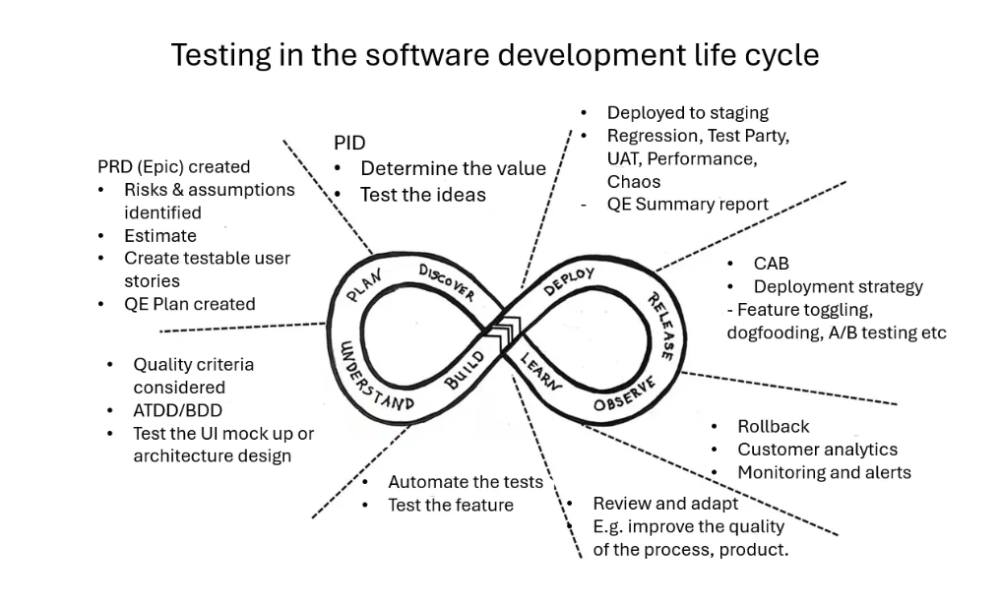

# Quality Engineering

## 1.0 About the Company

### 1.2 What are our key capabilities?

TODO: Improve this Markdwon file

* Software development
* Quality engineering
* DevOps
* Our team of experts has years of experience in software development, quality engineering, and DevOps.

### 1.3 Who are <Company Name> customers?

* Our customers are businesses that need high-quality software solutions to improve their operations and competitiveness.

## 2.0 Quality Engineering Strategy

### 2.1 <Company Name> Quality Engineering Mission Statement

> **To meet or exceed established quality standards and customer expectations to contribute to <Company Name> long term success.**
>
> Our mission is to ensure that our software solutions meet the highest quality standards and exceed our customers' expectations.

### 2.2 Quality Engineering Principles

#### 2.2.1 Why Principles?

* To guide our decision-making and ensure consistency
* Our principles are the foundation of our quality engineering strategy and guide our decision-making process.

#### 2.2.2 What are the principles?

* **Risk and value** – Exploring the possibilities of something bad happening (risk) and focusing on what matters the most (value)
* **Shift left** – Starting early on projects to enable problems to be found earlier
* **Continuous improvement** – Embracing the agile mindset of inspecting and adapting
* **Automation First** – Automating tests for efficiency gains
* **Testability as a foundation** – Making it easy for software to be tested

#### 2.2.3 Testing in the software development life cycle

This diagram displays how testing is involved throughout the software development life cycle. A way to think of this is that we are testing more than the code. We are looking at anything produced. For example, it could be documentation or UI mock-ups.

TODO: Fix this diagram to be more readable

## 3.0 Testing Techniques

### 3.1 Ad hoc Testing

* Unstructured testing to discover unexpected behavior
* Ad hoc testing is a technique used to test software without a pre-defined test plan or test cases.

### 3.2 Scenario Based Testing

* Creating realistic scenarios to mimic user interactions
* Scenario-based testing is a technique used to test software by creating realistic scenarios that mimic user interactions.

### 3.3 Pair or Group Testing

* Two testers collaborate—one actively testing, the other observing and providing feedback
* Pair or group testing is a technique used to test software by having two or more testers work together.

### 3.4 Error Guessing

* Based on experience, intuition, and domain knowledge, testers deliberately guess where defects might exist
* Error guessing is a technique used to test software by guessing where defects might exist based on experience and domain knowledge.

### 3.5 Boundary Value Analysis

* Test values at the boundaries of input domains (minimum, maximum, and edge cases)
* Boundary value analysis is a technique used to test software by testing values at the boundaries of input domains.

### 3.6 Equivalence Partitioning

* Divide input data into equivalence classes. Test representative values from each class
* Equivalence partitioning is a technique used to test software by dividing input data into equivalence classes and testing representative values from each class.

### 3.7 Exploring Invalid Inputs

* Purposefully input invalid data to see how the system handles it
* Exploring invalid inputs is a technique used to test software by inputting invalid data to see how the system handles it.

### 3.8 Time-Boxed Testing

* Allocate a specific time (e.g., 30 minutes) for exploratory testing. Focus on high-risk areas
* Time-boxed testing is a technique used to test software by allocating a specific time for exploratory testing and focusing on high-risk areas.

### 3.9 State Transition Testing

* Test how the system behaves as it transitions between different states or modes
* State transition testing is a technique used to test software by testing how the system behaves as it transitions between different states or modes.

### 3.10 Data-Driven Testing

* Use different data sets to explore variations in behavior
* Data-driven testing is a technique used to test software by using different data sets to explore variations in behavior.

### 3.11 Risk-Based Exploration

* Prioritize testing based on risk assessment. Focus on critical features or areas
* Risk-based exploration is a technique used to test software by prioritizing testing based on risk assessment and focusing on critical features or areas.

## 4.0 Tooling

### 4.1 Tool Inventory

* [Quality Testing

### 4.1 Tool Inventory

Tool inventory can be found here: [Quality Testing Tool Inventory (notion.so)](https://www.notion.so/Quality-Testing-Tool-Inventory-22ef5ad144064ed1820590dd33fe5165?pvs=21)

## 4.2 Test management tool

To record and track our testing we use a tool called TestRail.    It allows us to design test cases, organize test suites, execute test runs and track their results.

## 4.3 Test automation tool

We are using [Playwright](https://playwright.dev/) for our end to end test automation suites.

# 5.0 Approaches

## 5.1 Considering Functional and Non-Functionals from the Start

At the start of a project, we need to say what’s in scope and out of scope from this list in a Test Plan:

| **Quality Characteristics** | **More details** |
| --- | --- |
| **Capable**
Can it perform the required functions? | • Sufficiency: the product possesses all the capabilities necessary to serve its purpose.  
• Correctness: it is possible for the product to function as intended and produce acceptable output |
| **Reliable**

* Will it work well and resist failure in all required functions? | • Robustness: the product continues to function over time without degradation, under reasonable conditions.
 • Error handling: the product resists failure in the case of bad data, is graceful when it fails, and recovers readily.
• Data Integrity: the data in the system is protected from loss or corruption.
• Safety: the product will not fail in such a way as to harm life or property |
| **Usable and Accessible**
 How easy is it for a real user to use a product? | • Learnability: the operation of the product can be rapidly mastered by the intended user.
• Operability: the product can be operated with minimum effort and fuss.
• Accessibility: the product meets relevant accessibility standards and works with O/S accessibility features. |
| **Charisma**
How appealing is the product? | • Aesthetics: the product appeals to the senses.
• Uniqueness: the product is new or special in some way.
• Entrancement: users get hooked, have fun, are fully engaged when using the product.
• Image: the product projects the desired impression of quality. |
| **Secure**
How well is the product protected against unauthorised use or intrusion? | • Authentication: the ways in which the system verifies that a user is who he says he is. • Authorization: the rights that are granted to authenticated users at varying privilege levels. • Privacy: the ways in which customer or employee data is protected from unauthorized people. • Security holes: the ways in which the system cannot enforce security (e.g. social engineering vulnerabilities) |
| **Scalable**
 | • This is the ability for the system to scale to meet increasing demands
• What are the scalability requirements (How many users, data volumes, peak loads)
• Traffic Patterns, Elasticity, Latency
• Autoscaling?
 |
| **Compatible**
How well does it work with external components & configurations? | • Application Compatibility: the product works in conjunction with other software products.
• Operating System Compatibility: the product works with a particular operating system.
• Hardware Compatibility: the product works with particular hardware components and configurations.
 • Backward Compatibility: the products works with earlier versions of itself.
• Product Footprint: the product doesn’t unnecessarily hog memory, storage, or other system resources. |
| **Compliant**
 | • Telecommunications Security Act [Telecommunications (Security) Act 2021 (legislation.gov.uk)](https://www.legislation.gov.uk/ukpga/2021/31/enacted)
• GDPR regulations
• OfCom Regulations
 |
| **Performant**
How speedy and responsive is it? | • What are the performance requirements for the various parts of the system?
• VUsers, Volumes, Transaction rates/Throughput, Response Times, Percentile 90% / 95% ranges, normal & peak load profiles |
| I**nstallable**  
How easily can it be installed onto its target platform(s)? | • System requirements: Does the product recognize if some necessary component is missing or insufficient? • Configuration: What parts of the system are affected by installation? Where are files and resources stored? • Uninstallation: When the product is uninstalled, is it removed cleanly? • Upgrades/patches: Can new modules or versions be added easily? Do they respect the existing configuration? • Administration: Is installation a process that is handled by special personnel, or on a special schedule? |
| **Testability**

How well can we create, test and modify it? | • Can we automate this and improve efficiencies?
Supportability: How economical will it be to provide support to users of the product?  
• Testability: How effectively can the product be tested?  
• Maintainability: How economical is it to build, fix or enhance the product?
 • Portability: How economical will it be to port or reuse the technology elsewhere?
 •  Localizability: How economical will it be to adapt the product for other places? |
| **Availability** | • What is the uptime target? Specify using the 'nines' notation.
• Availability targets are often documented in the SLAs for the system
• Different parts of the system might have different availability requirements |
| **Resiliency** | • How will the system detect failures and adapt to them or recover from them?
• Each component/service needs to demonstrate it can recover from a failure yet remain functional by establishing continuity in the workflows, the behaviour needs to be fully understood |
| **Observability** | • Alerts & Monitoring
• Tiered levels of support L1 / L2 / L3
• Logging
• Correlation IDs generated at receipt of request, passed on to all subsystems and API calls, and included in all logs |

## 5.2 Automation in Testing

Early in the project we need to look at automated testing and do an automation feasibility analysis – this looks at what value it adds to automate / areas worth automating.

Automation Feasibility worksheet: <https://<Company Name>.sharepoint.com/:x:/r/sites/glasslike/_layouts/15/Doc.aspx?sourcedoc=%7B7FB950F2-B651-41A4-8830-60B679C28284%7D&file=What%20to%20Automate%20Worksheet.xlsx&action=default&mobileredirect=true>

The strategy is for more faster reliable automated tests over slower more brittle tests.

## 5.3 Environments

| **Environment** | **Activities Performed** |
| --- | --- |
| Development | Development
Feature Testing
Bug Fixes |
| Staging | Regression
Customer UAT
Test Parties (internal UAT)
Non-Functional Testing i.e. performance/security |
| Production | Smoke testing |

## 5.4 Test data

The user journeys / workflows will need test data to be created and prepared in advance for the test scripts / cases.  In the case of load and performance testing the amount of data needed beforehand will be determined by the volumetrics.

The decision to use real data, if available and accessible, or synthetic data for testing will depend on what safeguarding measures are in place for the test environment.

Using real data, sanitised, for testing can offer more accurate insights into system performance, behaviour, and edge cases, as it reflects actual user interactions and patterns.

## 5.5 Browsers and Devices

### Browsers

We will consider the four browsers on their latest versions from the highest priority to lowest based on the latest stats usage found here [Browser Market Share Worldwide](https://gs.statcounter.com/browser-market-share):

* Chrome
* Safari
* Edge
* Firefox

# 6.0 Analysis and Reporting / QE artefacts

* Requirements Testability Review
* QE Plans
* Test cases
* Progress reports /dashboards
* QE summary report
* Automation Feasibility Assessment
* Exploratory session reports
