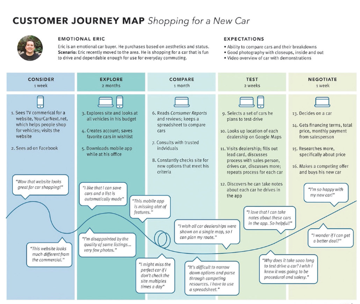

### Journey maps
What is it?
Visual representations that outline the steps a user will take to achieve a specific purpose or outcome while navigating a product.

### Purpose
To better understand a user's perspective, identify opportunities for improvement, and focus on creating tests around a user’s experience.

